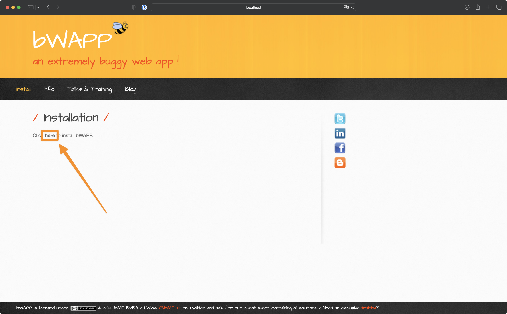
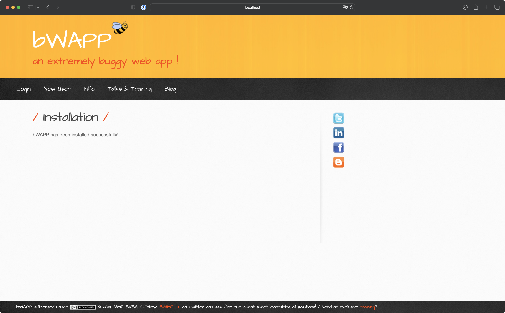
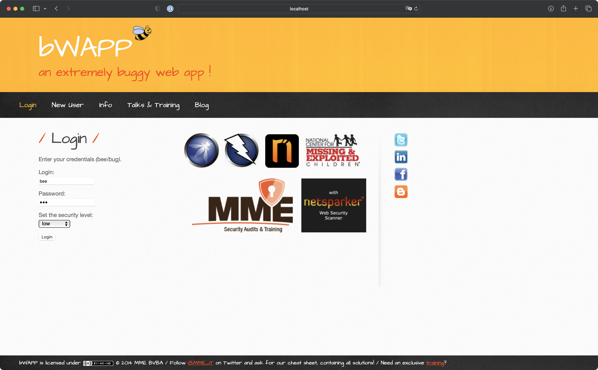

# Docker Compose bWAPP 

## 설치 방법

> 먼저 **docker**와 **docker compose**를 설치해주세요 https://docs.docker.com/engine/install/

```bash
docker compose up -d
```

## 초기 설정

> `http://localhost:20080/install.php` 로 접속하여 bWAPP 설치를 진행합니다.




## 로그인

> `http://localhost:20080/login.php` 로 접속하여 로그인을 진행합니다.

```text
Login: bee
Password: bug
```

